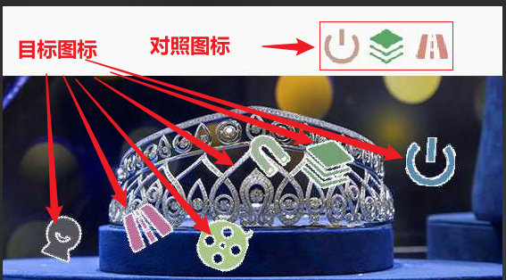
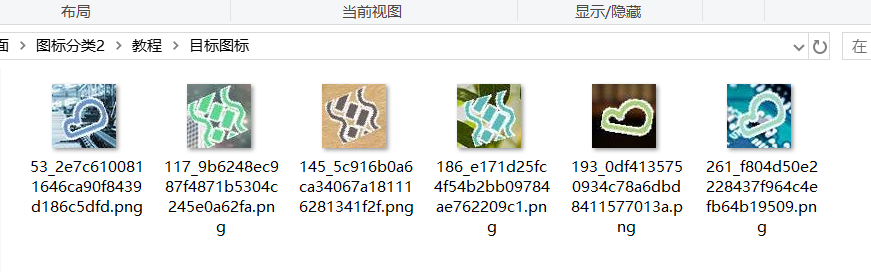

## 本人24个验证码实战视频教程，后续会更新十几个，每个教程都有配套的数据样本，训练代码，成品模型，推测代码，2k出售，有问题可以随时问，详情联系本人：tomysky67

## 试看视频 顶象空间推理.mkv 链接: https://pan.baidu.com/s/1ly-wmD5GMHpwTb2PpF8-ww?pwd=6666 提取码: 6666

# 图标点选快速分类

视频教程地址：https://www.bilibili.com/video/BV1eBDkYyEVY

github地址：https://github.com/tomysky/auto_classify

## 1.简介

> ​	图标点选单的分类如果过多，该如何减少工作量？
>
> ​	先训练yolo检测模型，分为对照的text和目标的target
>
> ​	先把对照图标切出来，用图片的**名称_uuid**作为切下的小图的名称，如下图所示：
>
> 
>
> ​	因为目标图标也是按照这种方式命名的，我们把切出的对照图标分类后，就可以根据图片原名称找对应的目标图标。
>
> 
>
> ​	这是分类好的效果：
>
> 
>
> 
>
> ​	每个分类先分类好15-20个就可以，训练好一个初级模型后，在用初级模型去识别其他的目标图案，把识别好的分类的图标放到对应的文件夹下，增加样本。
>
> ​	最后在人工检查一遍，确定没问题就训练一个最终模型。

## 2.训练yolo检测

> ​	我用yolo模型是yolo11m.pt的预训练模型。目标分为target和text，总计标记300张。

## 3.自动分类

> ​		因为对照的图片背景干净，没有干扰，我就用这个作为分类依据。先用yolo把text分类（也就是对照图标)切下来。然后把第一张图标作为分类的依据，跟后面的图标计算相似度，如果相似度高比如大于0.89就认为是同一类，放在用数字开头的文件夹里，并删除源文件防止干扰后续的匹配。
>
> ​	我用的是resnet50提取每个图标的特征值，然后以第一张图标为基准和后面的每张图标计算相似度，相似度大于0.89就是同一类的，把这些同一类的图标复制到一个文件夹里，因为此时还不知道分类所以用数字代替分类名。
>
> ​	图片1000张，分类出目标图标3000个，自动分类大概6-8小时。

## 4.手动分类

> ​	因为自动分类是有问题的，这时候需要手动校验每个分类的图标，并且起名。800个自动分类手动校验后剩下200个左右，时间大概2小时。

## 5.半自动复制目标图标

> ​	上一步只是把对照图标分类好了，对应的目标图标还没有分类。比如
>
> 53_b9dd33554606424ca53178b9e316d199.png这张图是对照图标，那么它对应的图片53.png就能切下来一张目标图标53_2e7c6100811646ca90f8439d186c5dfd.png。这时我们就需要去目标图标文件夹里去找这张图，把它复制到当前这个分类文件夹里。
>
> 
>
> 
>
> ​	我为此写了一个小工具实现上面的功能。最上面的就是对照的图标，下里面的6个图标就是同一张图切出来的6个目标图标。我们手动点击同一个分类的图标，程序就会自动复制图片到对应的分类。
>
> 
>
> ​	3000个图标，耗时40分钟左右分完。

## 6.训练后在分类

> ​	上面几步处理完成的分类里，我们只把目标图标和对应的对照图标分类完了。但是目标图标是有6个，对照图标3个，处理后还剩3个目标图标。
>
> 
>
> ​	为了增加样本量和准确率，我们需要用现在的分类训练一个中精度的模型，然后用这个模型来识别剩下的目标图标，并把剩下的图标自动分类；接着去校验一下自动分类的图标有没有问题。最后在训练一个高精度的模型。

## 7.提升效率1

> ​	yolo模型转换为onnx，resnet50训练的模型也转为onnx使用

## 8.提升效率2

> ​	两个模型其实效率肯定低，我们可以用训练好的这两个模型，自动给图片打标成yolo格式，包含每个图标的位置和分类。训练一个yolo模型，因为yolo模型的分类不能太多了，所以100-200左右的分类可以使用这种办法优化推理效率。
>
> 
>
> ​	实测效果准确，200个左右的分类yolo是可以识别的。效率测试能达到两个模型的3倍以上

## 9.总结

> ​	以上的图标点击，200个分类左右，有工具的情况下2-3天就能搞完整个流程。没用工具，光分类就的累死人。	
>
> ​	图标文字点选的难点不在于模型上，毕竟这些都有成熟的框架和现成的代码。你有成功的案例，下次套用就行了。难点就是手动分类费事费力，需要自己写工具半自动分类加快速度。
